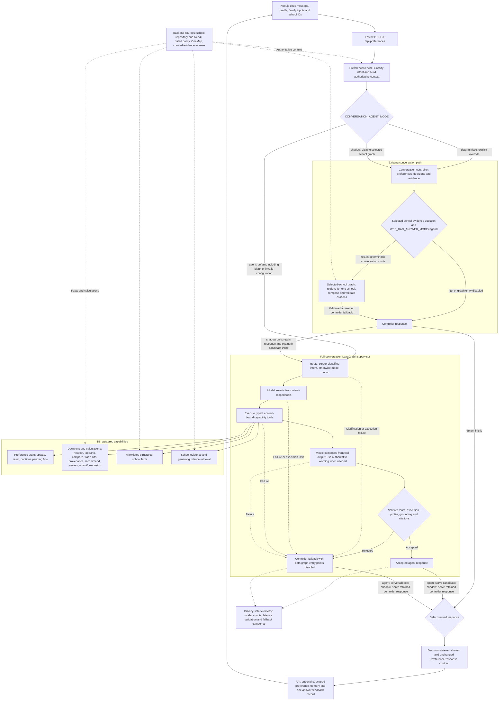

# KinderCompass agent architecture

The backend uses a bounded LangGraph conversation supervisor with typed capability
tools and an independently configurable selected-school evidence graph. School
facts, preference changes, ranking, eligibility, fees, and distance calculations
remain backend-owned.

- **Bounds:** the supervisor allows at most three capability calls and one profile
  mutation per turn; the default route/model iteration limit is six. The separate
  selected-school graph defaults to one retrieval call and three model iterations.
- **State:** each graph runs for one request. The returned profile carries
  conversation continuity; opt-in SQLite memory stores selected structured
  profile fields with 180-day retention rather than raw chat or family inputs.
- **Rollout:** agent is the default for missing, blank, or invalid configuration.
  Set `CONVERSATION_AGENT_MODE=deterministic` to use the existing controller.
  Shadow evaluates inline without
  changing the served controller response. Agent mode serves validated output
  and falls back to the controller on failure.
- **Grounding:** citation validation enforces source and school scope. General
  supervisor wording validation is lexical; selected-school evidence answers
  preserve the retrieval adapter's wording.

Implementation references: [PreferenceService](../SystemCode/src/backend/services/preference_service.py),
[supervisor](../SystemCode/src/backend/agents/supervisor.py),
[tools](../SystemCode/src/backend/agents/tools.py),
[validation](../SystemCode/src/backend/agents/validation.py), and
[readiness and rollout record](../SystemCode/src/backend/doc/agents.md).
