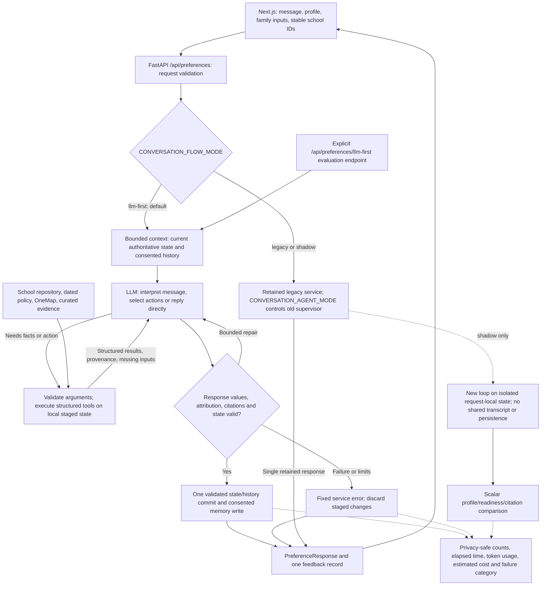

# KinderCompass agent architecture

The default chat endpoint runs the bounded LLM-first loop. Repositories own
school facts and policy; deterministic tools own ranking, fees, eligibility,
distance and validated preference updates.

The loop permits zero-tool greetings/clarifications and dependent, combined
requests. It allows eight model invocations, twelve tool calls, four mutations
and 30 seconds by default; bounded repair shares those budgets. Failed turns
never run legacy fallback. Shadow adds inline latency but never writes history,
preference memory or answer feedback.

`CONVERSATION_FLOW_MODE=legacy` selects rollback; use the existing
`CONVERSATION_AGENT_MODE=deterministic` for controller-only rollback. Retain
legacy wrappers for the seven-day observation period and review before cleanup.
School-demo gates passed; strict evaluation and production readiness remain
unmet. See [rollout contract](../SystemCode/src/backend/doc/llm-first-rollout.md),
[HTTP integration](../SystemCode/src/backend/doc/llm-first-http.md) and
[backend progress](../SystemCode/src/backend/doc/agents.md).
