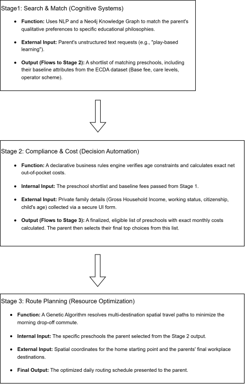

# KinderCompass: Project Summary

**Objective:** Build an intelligent multi-stage decision support system to assist parents through preschool selection in Singapore

## System Architecture (3-Stage Pipeline with Data Flow)

### Stage 1: Search & Match (Cognitive Systems)
*   **Function:** Uses NLP and a Neo4j Knowledge Graph to match the parent's qualitative preferences to specific educational philosophies.
*   **External Input:** Parent's unstructured text requests (e.g., "play-based learning").
*   **Output (Flows to Stage 2):** A shortlist of matching preschools, including their baseline attributes from the ECDA dataset (Base fee, care levels, operator scheme).

### Stage 2: Compliance & Cost (Decision Automation)
*   **Function:** A declarative business rules engine verifies age constraints and calculates exact net out-of-pocket costs.
*   **Internal Input:** The preschool shortlist and baseline fees passed from Stage 1.
*   **External Input:** Private family details (Gross Household Income, working status, citizenship, child's age) collected via a secure UI form.
*   **Output (Flows to Stage 3):** A finalized, eligible list of preschools with exact monthly costs calculated. The parent then selects their final top choices from this list.

### Stage 3: Route Planning (Resource Optimization)
*   **Function:** A Genetic Algorithm resolves multi-destination spatial travel paths to minimize the morning drop-off commute.
*   **Internal Input:** The specific preschools the parent selected from the Stage 2 output.
*   **External Input:** Spatial coordinates for the home starting point and the parents' final workplace destinations.
*   **Final Output:** The optimized daily routing schedule presented to the parent.

## Strategic Justifications (Project Scope)

We chose to exclude the **Knowledge Discovery** (Hybrid Recommender Core) module for two main reasons:
*   **Qualitative Matching via Knowledge Graph:** The system already connects qualitative parent preferences to structural preschool traits using Singapore’s validated Nurturing Early Learners (NEL) framework, effectively solving the "cold start" problem without needing historical user rating scores.
*   **Data Authenticity:** True collaborative filtering requires massive historical user-rating matrices. Since public datasets lack this, building one would require synthetic, fake data, which detracts from the system's real-world practicality and implementation value.
