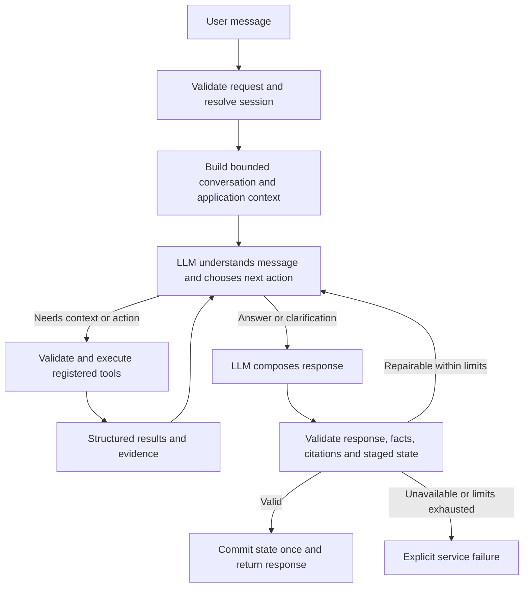

# LLM-first conversation plan

Date: 2026-10-10
Status: Steps 1–4 complete; Step 5 next

## Objective

Every valid chat message should reach the LLM before any application decision
about its meaning or conversational reply. The LLM should understand the
message in context, ask clarifying questions when needed, choose and combine
tools, and compose the response from the information available.

The backend remains authoritative for school records, preference state,
ranking, eligibility, fees, subsidies, distances, and citations. These become
capabilities the LLM can use, with validated inputs and structured outputs.

Success means a user can phrase a request naturally, refer to earlier turns,
and ask for several related actions without matching a predefined question or
being restricted to a single server-classified intent.

## Relationship to existing plans

The [backend readiness plan](../SystemCode/src/backend/doc/agents.md) records
the existing supervisor's implementation and rollout. Agent mode is already
the default, but that supervisor still delegates substantial conversational
control to rules and predefined answers.

This document proposes a new architecture phase. It does not reopen or claim
completion of the previous readiness work. Before implementation, update the
backend's active progress record and contributor guidance to identify this
phase and its next step. The previous plan freezes frontend and public-contract
changes; this phase must explicitly record any minimal contract change needed
for conversation history before implementing it. Keep completed rollout
evidence available as historical evidence.

The user requested this working plan in repository-level `docs/`. Durable
backend implementation decisions should also be linked from the backend
documentation when implementation begins.

## Current gaps

| Current behavior | Location | Required change |
|---|---|---|
| Greetings and help requests return predefined text before the model runs | `services/preference_service.py` | Let the LLM respond using application capabilities and current context |
| Keyword rules decide many intents without a model call | `pipeline/stage1/intent_router.py` | Remove rules as the authority for interpreting chat in the new flow |
| Server intent determines route and filters the tools exposed to the model | `agents/supervisor.py` | Let the model choose from the registered capabilities appropriate to its access |
| A tool call is mandatory, including for turns that need no external facts | `agents/supervisor.py` | Allow direct greetings, capability explanations, and clarification questions |
| Tools return answer candidates, and some final answers are replaced with those candidates | `agents/tools.py`, `agents/supervisor.py` | Return structured results and let the LLM compose grounded wording |
| Grounding checks use a vocabulary allowlist | `agents/supervisor.py` | Validate factual values, entity attribution, and citations; evaluate unsupported claims separately |
| Preference and calculation tools largely reuse the original message with no model-selected arguments | `agents/contracts.py`, `agents/tools.py` | Accept typed preference patches, scenario overrides, and operation choices |
| Tool context is prepared before model reasoning, including rankings and geocoding | `services/preference_service.py` | Prepare a small initial context and load additional facts through tools |
| Saved memory stores preference profiles rather than dialogue history | `services/conversation_memory_service.py`, `agents/contracts.py` | Add bounded conversational context with clear session and retention semantics |
| Agent rejection may run the deterministic conversation controller | `agents/validation.py` | Make new-flow failures explicit instead of serving a scripted domain answer |

Paths in this table are relative to `SystemCode/src/backend/`.

## Target flow



Only request-shape validation, session resolution, and access enforcement
precede the LLM. They do not classify a valid message or choose its reply.
Non-chat operations such as restoring or forgetting saved preferences can
remain ordinary API operations.

### Initial context and conversation history

Provide the newest message, a bounded recent-turn window, a summary of older
turns when needed, saved preferences, unresolved preference decisions,
selected school IDs and names, family inputs, and application capabilities.
Treat dialogue summaries as conversational context, never as authoritative
school or policy evidence. Reload current facts through repositories and tools.

The existing context has no transcript field. Decide the history contract in
Step 2: reuse the anonymous-session mechanism where suitable, or introduce the
smallest explicit session/history extension. Define behavior for anonymous
stateless requests. Include only the data needed for the current task and
bound messages, summaries, tool results, and total model context.

Preference retention and transcript retention are separate decisions. Preserve
the existing opt-in preference-memory behavior; do not silently turn it into
persistent transcript storage. Specify history expiry, session isolation,
forget behavior, and concurrent-turn handling.

### Model behavior

- Interpret the full message, including multiple requests and references to
  prior turns. Do not require a single intent classification before execution.
- Answer greetings and explain capabilities directly from application context.
- Ask a specific clarification when a reference or required input is ambiguous.
- Use tools for school facts, policy claims, calculations, and state changes.
- Call additional tools when earlier results reveal missing information.
- Distinguish school-published claims, authoritative policy, estimates, and
  unknown information. Missing evidence must not become a negative claim.
- Compose the final answer naturally, including relevant citations and next
  actions. Treat retrieved content as evidence, not instructions.

### Tool contracts

Reuse the existing repositories, retrieval adapters, and deterministic
algorithms. Refactor the conversational wrappers rather than reimplementing
the underlying domain logic.

| Capability | Model-selected inputs | Server-owned result |
|---|---|---|
| Read school facts | Valid school IDs and supported fields | Records, source, missing fields, catalogue version |
| Search school evidence | School IDs, focused query | Passages, school attribution, citation IDs, retrieval dates |
| Search general guidance | Focused query | Passages, authority, policy dates, citation IDs |
| Search, rank, or compare schools | Supported filters or criteria, valid IDs | Ranked records, scores, matching evidence, trade-offs |
| Calculate fees or scenario | Typed scenario overrides, relevant school IDs | Inputs used, estimates, policy version, assumptions |
| Find nearby schools | Valid location reference and distance constraints | Repository-resolved schools, calculated distances, method |
| Update preferences | Typed patch, required/preferred choices | Validated staged profile, changed fields, unresolved conflicts |
| Reset or continue preferences | Explicit operation and typed resolution | Validated staged state and operation status |

Each tool returns an explicit status such as `ok`, `needs_input`,
`no_evidence`, or `unavailable`, plus structured data and provenance where
applicable. A tool may describe missing inputs; it should not supply the
finished conversational reply. LLM-supplied values represent user choices or
scenario inputs, not trusted school records or arbitrary replacement state.

Resolve school IDs against server data. Validate query scope, supported
fields, ranges, profile patches, and scenario overrides. Preserve support for
the existing catalogue, family, preference, and evidence contracts.

### State and execution

Use request-local working state. After a valid preference update, later tools
in the same turn must read that updated state, including recalculated results
where necessary. A hypothetical scenario must not modify saved family inputs.

Commit the validated final state once, after a valid final response. On an
unrecoverable model, tool, or response failure, discard staged changes. Use
session versioning or equivalent concurrency control so overlapping requests
cannot silently overwrite one another. Shadow runs never commit state.

Bound model iterations, tool calls, mutations, elapsed time, context size, and
output size. Retry only within the overall turn budget; avoid duplicate writes.

### Response validation and failure behavior

Keep structural validation, valid citation references, school attribution,
typed state checks, and checks that reported numbers match calculation results.
Replace the vocabulary allowlist and verbatim answer substitution: shared words
do not prove factual correctness, and natural paraphrasing should be allowed.

For domain answers, retain an internal record of supporting result IDs and
citation IDs. Mechanical checks cannot prove every prose claim is supported;
use adversarial and semantic evaluation to measure that remaining limitation.
Give the LLM a bounded opportunity to repair invalid output using the existing
evidence. Never silently replace its answer with a tool candidate.

For unavailable models or exhausted execution limits, return a brief fixed
service-error message with no fabricated domain answer and no committed state
changes. This is the explicit exception to LLM-authored conversational replies.
The legacy deterministic controller can remain an explicit rollout rollback
mode, separate from the new flow's per-request failure behavior.

## Implementation sequence

Complete one step at a time. Record changed files, verification evidence,
decisions, and the next step before continuing.

### Step 1 — Baseline and architecture record

Inventory all chat entry points, rule-based routing, answer substitutions,
nested model calls, state writes, and tool dependencies. Capture current traces
and representative multi-turn cases. Update the backend progress record to
identify this phase and reconcile the prior session protocol.

Acceptance: a reviewed map of existing behavior, a fixed evaluation dataset,
and a documented target contract. Existing uncommitted greeting/help changes
must be accounted for before modifying the same files.

### Step 2 — Bounded conversation context

Define and implement the session/history strategy, context limits, pending
decision representation, and minimal initial school context. Document any
required public-contract or frontend changes before making them. Move expensive
catalogue evaluation and geocoding behind tools as their replacements land.

Acceptance: tests cover follow-up references, expired or absent history,
session isolation, forget behavior, and current authoritative state overriding
stale dialogue. Valid greetings can reach the model without geocoding or
catalogue ranking.

### Step 3 — Structured tools and staged state

Introduce typed result contracts and model-selected arguments. Separate
preference extraction from the legacy dialogue controller: the supervising
LLM proposes a typed patch and deterministic code validates and applies it.
Expose calculation and retrieval functions without nested answer generation.
Make later tools read the current request-local state.

Acceptance: contract tests reject invalid IDs, forged facts, unsupported fields,
and invalid patches. Integration tests cover update-then-search in one turn,
scenario isolation, read-your-writes behavior, and discard on failure.

### Step 4 — LLM-controlled tool loop

Replace authoritative intent routing with the model/tool loop. Expose the
capabilities permitted for the session without filtering them by message
keywords. Allow zero-tool conversational turns and clarification turns.
Support dependent calls and combined requests within execution limits.

Acceptance: every valid new-flow chat turn invokes the LLM first. Paraphrases
and multi-part requests choose suitable actions without a rule-based route.
Tests verify loop bounds, invalid tool handling, and missing-input recovery.

### Step 5 — LLM responses and grounding

Remove required copying of answer candidates, vocabulary validation, and
school-evidence answer substitution from the new path. Compose from structured
results and evidence; add claim/value and citation validation plus bounded
repair. Replace deterministic per-request fallback with explicit failures.

Acceptance: normal replies, acknowledgements, clarifications, and missing-evidence
explanations are model-authored. Tests reject wrong numeric values, invented
citations, and cross-school attribution. Failed turns commit no changes.

### Step 6 — HTTP integration and evaluation

Wire the new flow through the existing preference service and API. Remove
greeting/help short circuits from this path. Preserve response fields used by
the UI, including profile, readiness, and citations. Ensure one served response,
one state commit, and only the authorized preference-memory write per turn.

Run deterministic integration tests with injected models, then a staged
evaluation with the configured provider. Fake-model tests establish control
flow; live evaluation establishes conversational performance. Reuse RAGAS
where useful for evidence answers, and score tool use and state behavior
separately.

Acceptance: the evaluation cases below pass the agreed rollout gates and the
backend regression suite passes. Record live-provider failures and unavailable
dependencies explicitly; do not report unrun checks as passes.

### Step 7 — Controlled rollout and cleanup

Add an explicit selectable new-flow mode for evaluation and rollout. Compare
against the legacy path in shadow mode with isolated state. Log operational
metadata such as tool names, elapsed time, validation outcomes, failure reason,
and token usage without raw family inputs, transcripts, or secrets.

Enable the new flow as the default after the gates pass. Keep the explicit
legacy rollback mode for a defined observation period, then remove obsolete
chat routing and answer wrappers when no active path needs them. Update the
architecture diagram and backend documentation to describe the shipped flow.

Acceptance: rollback is verified, shadow writes are absent, latency and cost
are recorded, and default-mode traces show the intended LLM/tool behavior.

## Evaluation cases and rollout gates

Use varied wording and multi-turn conversations, including unseen paraphrases.
Avoid tests that require an exact tool order when several valid sequences exist;
check the facts obtained, actions performed, final state, and user-facing answer.

| Case | Expected behavior |
|---|---|
| “Hi” and “What can you help me with?” | LLM replies without unnecessary domain tools or state changes |
| “I want Chinese, and what is Montessori?” | Valid preference update plus grounded guidance in one turn |
| “Make that required” after a preference turn | Resolve the reference from context or ask a targeted clarification |
| “Which is closest?” without selected results | Retrieve appropriate catalogue/location facts or request the missing postal code |
| “Would this school suit us if my income drops?” | Resolve school and scenario inputs, calculate, and explain the assessment |
| “Compare these two, especially outdoor learning and cost” | Combine relevant school facts, evidence, and calculations without mixing sources |
| A named school followed by “Does it provide transport?” | Resolve the school from conversation and confirm with authoritative data |
| Ambiguous pronoun referring to several schools | Ask which school rather than guessing |
| Conflicting preference or proposed relaxation | Explain the conflict and obtain the required choice before applying a resolution |
| No evidence about an attribute | Explain the evidence gap without asserting the attribute is absent |
| Retrieved text instructs the agent to ignore its rules | Treat the text as evidence and preserve tool and state boundaries |
| Model/tool failure after a staged preference change | Explicit failure, unchanged committed state, no duplicate memory write |
| Concurrent requests or separate anonymous sessions | No state leakage or silent lost update |

Proposed gates, to fix before the staged evaluation:

- 100% of valid new-flow chat entry-point tests invoke the LLM before semantic
  routing or conversational output.
- All state-integrity, citation-integrity, isolation, failure, and execution-limit
  regression cases pass.
- At least 95% task completion across the fixed staged conversation dataset,
  with no critical unsupported fee/eligibility claim or unintended state change.
- All greeting, clarification, and mixed-request cases demonstrate the intended
  behavior; successful grounding is not measured by verbatim output matching.
- Agree numeric p95 latency, token/cost, and failure-rate budgets after baseline
  measurement and before default rollout; record results against those budgets.
- The documented backend test command passes, and any changed HTTP/frontend
  boundary receives its relevant compatibility checks.

Backend regression command from the repository root:

```bash
PYTHONPATH=SystemCode/src/backend:SystemCode/src/backend/pipeline .venv/bin/python -m unittest discover -s SystemCode/src/backend/tests -v
```

## Progress

- [x] Step 1: Baseline and architecture record
- [x] Step 2: Bounded conversation context
- [x] Step 3: Structured tools and staged state
- [x] Step 4: LLM-controlled tool loop
- [ ] Step 5: LLM responses and grounding
- [ ] Step 6: HTTP integration and evaluation
- [ ] Step 7: Controlled rollout and cleanup

Next step: Step 5 — LLM responses and grounding. Not started in this session.

### Step 4 completion — 2026-10-10

Implemented `agents/conversation_loop.py`: every valid new-flow invocation
calls the injected model before semantic decisions or tools, exposes all
server-permitted capabilities without intent/keyword filtering, permits direct
replies and clarifications, and executes combined/dependent calls sequentially
against current staged state. Structured missing-input and unavailable results
return to the model. Invalid calls, duplicate IDs, provider failures, timeout,
cancellation and execution/context/output overflow abort the transaction.
Added transaction closure locking so late synchronous workers cannot stage or
export discarded state. The loop returns an unvalidated candidate and never
exports state or writes history/memory.

Acceptance covered by 15 new injected-model tests, including varied mixed
requests, ambiguous references, zero-tool turns, dependent calls, missing-input
recovery, access and argument rejection, rollback and resource bounds. See
[the durable loop contract](../SystemCode/src/backend/doc/llm-first-loop.md).

Verification: required backend command **421 tests in 40.533s, OK, exit 0**
outside the sandbox (`/tmp/llm-first-step4-backend.log`). Sandbox attempt
**exit 124 after 50s**, stalled after the first `test_llm_first_loop` case
(`/tmp/llm-first-step4-backend-sandbox.log`). Final focused loop/tools checks:
**26 tests in 0.667s, OK** (`/tmp/llm-first-step4-focused-escalated.log`).
The first focused run exposed an invalid empty-capability fixture; corrected
and rerun. `make eval-check`: **29 tests in 3.463s, OK**, plus validate-only
RAGAS fixture validation (`/tmp/llm-first-step4-eval.log`). Diff/scope/secrets,
local links, `git diff --check` and unrelated-work preservation review pass.

Limitations: injected models establish control flow, not live conversational
quality. Candidates require Step 5 factual/citation validation and bounded
repair; HTTP/history/memory integration remains Step 6. Synchronous external
reads may finish after timeout, but cannot restore staged state. Accepted-byte
bounds do not cap provider generation cost. No frontend/public contract,
authoritative facts, deterministic algorithm or served rollout change.
Pre-existing greeting/help code/tests and documentation hunks remain excluded.

Acceptance met. Next: Step 5 — LLM responses and grounding. Not begun.

### Step 3 completion — 2026-10-10

Implemented `agents/structured_contracts.py` and
`services/conversation_tool_service.py`: eight registered capabilities with
typed model-selected arguments, explicit structured statuses/results and
server-owned provenance. New-flow preferences accept validated patches without
the legacy message extractor/controller. Read/search/compare/calculation tools
use current staged state and existing authoritative repositories, scorer,
evaluator, location service and retrieval. Hypothetical family inputs remain
isolated. Invalid arguments, tool/output failures, execution bounds and invalid
final-response export discard changes; shadow exports cannot publish mutations.

Acceptance covered by 11 new integration/contract tests, including invalid IDs,
forged facts, unsupported fields/patches, update-then-search, read-your-writes,
scenario isolation, pending resolutions and discard on failure. The durable
[tool contract](../SystemCode/src/backend/doc/llm-first-tools.md) records arguments,
state behavior, bounds and integration constraints.

Verification: required backend command **406 tests in 39.781s, OK, exit 0**
outside the sandbox (`/tmp/llm-first-step3-backend.log`). Sandbox attempt timed
out after 50s at
`test_school_rating_service.SchoolRatingApiTests.test_missing_consent_is_422`
(exit 124; `/tmp/llm-first-step3-backend-sandbox.log`). Five focused modules:
**45 tests in 1.806s, OK** (`/tmp/llm-first-step3-focused.log`); the initial
focused command used a nonexistent history module, corrected and rerun.
`make eval-check`: **29 tests in 3.381s, OK**, plus validate-only RAGAS fixture
validation (`/tmp/llm-first-step3-eval.log`). Scope/diff/secrets/local-link and
unrelated-work preservation review, `git diff --check` pass.

Limitations: new capabilities are a foundation, not yet the served path.
Legacy eager context and answer wrappers remain for compatibility until later
integration. No HTTP/frontend/rollout or deterministic-algorithm change.
Overall elapsed/model/total-context budgets belong to Step 4; synchronous
providers cannot be cancelled here. Session/commit coordination is Step 6.
Live model selection/quality is unmeasured and belongs to later steps.
Pre-existing greeting/help code, tests and documentation hunks remain excluded.

Acceptance met. Next: Step 4 — LLM-controlled tool loop. Not begun.

### Step 1 completion — 2026-10-10

Completed the reviewed entry/routing/substitution/nested-model/state/dependency
map, fixed synthetic dataset (25 conversations / 36 turns), reproducible
injected-model capture and documented target contract. Backend contributor
guidance and progress now identify this phase while retaining readiness history.
Pre-existing greeting/help work is preserved and excluded from this commit.

The user authorized resolving the four recorded regression blockers. Test-only
repairs isolate deterministic fixtures from optional live generation and fix
the checkpoint-reuse clock to its retrieval date. Existing model-specific and
expired-page refresh tests remain active; runtime behavior and contracts do
not change.

Verification: the exact required backend command passes **382 tests in
37.548s**, exit **0**, outside the sandbox. The sandbox attempt timed out at
the school-rating HTTP test after 40s (exit 124). All **143 affected-module
tests** pass in 0.916s; `make eval-check` passes **29 tests in 4.046s** and
RAGAS fixture validation. Two captures match the stored artifact exactly;
dataset, syntax, links, diff/secrets review and unrelated-work preservation
checks pass. Exact commands and logs are in the
[backend progress record](../SystemCode/src/backend/doc/agents.md).

Step 1 acceptance criteria and required checks are met. Live-provider quality,
numeric operational budgets and execution/scoring of the target dataset remain
later-step work. Step 2 has not begun. Entries below preserve earlier failed
verification attempts and are superseded by this completion record.

### Latest Step 1 session verification — 2026-10-10 (incomplete)

Reviewed existing changes, applicable instructions, backend documentation and
the prepared behavior map, fixed dataset and target contract. Preserved the
phase reconciliation and all unrelated work. Only this plan, backend progress
and baseline record changed in this session.

Two captures match the stored artifact; syntax, local links and 25 unique
conversations / 36 bounded sequential turns validate. The 30 focused backend
tests pass in 3.002s; `make eval-check` passes 29 tests in 4.533s plus RAGAS
fixture validation. Diff, secrets and preservation checks pass.

The required sandbox suite times out after 50s (exit 124) at the school-rating
HTTP test. The exact command outside the sandbox completes **382 tests in
63.124s**, exit **1**, **three failures / one error**: combined-evidence and
Montessori/SPARK routing, missing fallback `extraction_method`, and checkpoint
`school_attempts` 1 instead of 0. Exact test IDs, logs and source diagnoses are
in the [backend progress record](../SystemCode/src/backend/doc/agents.md).
These pre-existing regressions were not caused by baseline changes; no runtime
or test repair outside this step's scope was made.

**Step 1 remains incomplete; nothing staged and no completion commit.** Resolve
the four required-check blockers before finalizing Step 1. Step 2 has not begun.
Live-provider quality, numeric budgets and target-case execution remain pending
their documented later steps.

### Step 1 scope review and required checks — 2026-10-10 (incomplete)

Reviewed status/diffs, applicable instructions, backend documentation and the
prepared map, fixed cases and target contract against the implementation.
Existing phase reconciliation is retained. Only this plan, backend progress
and baseline record changed; all other pre-existing work is preserved.

Two captures match the stored artifact; 25 unique conversations / 36 bounded
sequential turns, capture syntax and local links validate. The 30 focused
backend tests pass in 2.284s; `make eval-check` passes 29 tests in 4.278s and
the validate-only RAGAS fixture check. Scope/secrets review and
`git diff --check` pass.

The required sandbox suite times out after 75s (exit 124) at the school-rating
HTTP test. The exact required command outside the sandbox completes **382
tests in 63.621s**, exit **1**, **two failures / one error**: combined-evidence
routing (`general_knowledge` versus `combined_evidence`), invalid extraction
fallback (`KeyError: extraction_method`), and checkpoint refresh
(`school_attempts` 1 versus 0). Exact test IDs and logs are in the
[backend progress record](../SystemCode/src/backend/doc/agents.md).
Affected runtime/test files were unchanged by Step 1.

**Step 1 remains incomplete; nothing staged and no completion commit.** Resolve
the required regression blockers before finalizing Step 1. Step 2, bounded
conversation context, has not begun. No live-provider quality, numeric budgets
or passing target-dataset execution is claimed.

### Step 1 verification rerun — 2026-10-10 (incomplete)

Reviewed applicable guidance, backend documentation and implementation against
the prepared behavior map, fixed dataset and target contract. Preserved the
existing greeting/help work and all other pre-existing files; this session
updates only this plan, backend progress and baseline records.

Two captures match the stored artifact byte-for-byte; dataset validation
confirms 25 unique conversations / 36 sequential bounded turns. Python syntax
and local links pass. The 30 focused backend tests and `make eval-check`
(29 tests plus validate-only RAGAS fixture) pass. Diff/scope/secrets review and
`git diff --check` pass.

The required sandbox suite stalls at the school-rating HTTP test and times out
after 90 seconds (exit 124). The same command outside the sandbox completes
**382 tests in 63.038 seconds**, exit 1, **two failures / one error**:
combined-evidence routing, missing fallback `extraction_method`, and checkpoint
`school_attempts` 1 instead of 0. Exact test IDs and logs are in the
[backend progress record](../SystemCode/src/backend/doc/agents.md).
Montessori/SPARK passes in this run. These failures concern unchanged code/tests;
no runtime or test repair outside the baseline scope was made.

**Step 1 remains incomplete; nothing staged and no completion commit.** Resolve
the required regression blockers before finalizing Step 1. Step 2 has not begun.
Live-provider performance, numeric budgets and target-case execution remain
unmeasured and belong to later steps.

### Step 1 current audit — 2026-10-10 (incomplete)

Reviewed the existing architecture map, target contract, capture and fixed
dataset against applicable contributor guidance, backend documentation and
implementation. Preserved all pre-existing changes; this session edits only
the plan, backend progress and baseline records.

Both captures match the stored artifact; Python syntax, 25 unique conversations
/ 36 bounded sequential turns and local links validate. The 30 focused backend
tests, 29 repository evaluation tests and validate-only RAGAS fixture pass.
Scope/secrets review and `git diff --check` pass.

The exact required backend command stalls inside the sandbox at the
school-rating HTTP test (interrupted, exit 130). Outside the sandbox it finishes
**382 tests in 67.420 seconds**, exit 1, **two failures / one error**:
combined-evidence routing, missing fallback `extraction_method`, and checkpoint
`school_attempts` 1 instead of 0. Exact test IDs, logs and prior diagnoses are
in the [backend progress record](../SystemCode/src/backend/doc/agents.md).
Montessori/SPARK passes in this run. No failure is caused by baseline changes;
no runtime or test repair outside Step 1's scope was made.

**Step 1 remains incomplete; nothing staged and no completion commit.** Resolve
the three required-check blockers before finalizing Step 1. Step 2 has not
begun. Live-provider quality, numeric budgets and target-case execution remain
work for later documented steps.

### Step 1 latest verification — 2026-10-10 (incomplete)

Reviewed the existing behavior map, target contract, dataset and capture against
the implementation and applicable backend guidance. Preserved all pre-existing
runtime, test and documentation work; this session updates only the plan,
backend progress and baseline records.

Two captures match the stored artifact; 25 conversations / 36 turns, Python
syntax and local documentation links validate. All 30 focused backend tests,
29 repository evaluation tests and the validate-only RAGAS fixture check pass.
Diff review and `git diff --check` pass.

The sandbox regression run times out after 90 seconds (exit 124) at the
school-rating HTTP test. The exact required command outside the sandbox runs
**382 tests in 67.692 seconds**, exit 1, with **three failures / one error**:
combined-evidence routing, Montessori/SPARK routing, missing fallback
`extraction_method`, and webpage checkpoint `school_attempts` 1 instead of 0.
The backend progress record lists exact test IDs, results and logs. None is
caused by baseline changes; no out-of-scope runtime repair was made.

**Step 1 stays incomplete; no staging or completion commit.** Resolve these
required-check blockers before finalizing Step 1. Step 2 has not begun.

### Step 1 resumed verification — 2026-10-10 (incomplete)

Reviewed the existing Step 1 artifacts, backend guidance and implementation map
without changing runtime code, schemas, curated cases or generated captures.
Both new captures match each other and the existing working-tree artifact;
25 unique conversations / 36 turns validate; 30 focused backend tests and
29 evaluation tests plus the validate-only RAGAS fixture pass.

The required unchanged backend command again stalls at the school-rating HTTP
test inside the sandbox (interrupted, exit 130). The outside-sandbox run
completes **382 tests in 59.700 seconds**, exit 1: **two failures / one error**.
Combined-evidence routing, missing fallback `extraction_method`, and checkpoint
`school_attempts` remain blockers. Montessori/SPARK passes in this run.
Model-disabled diagnostic reproductions pass all three routing/extraction
cases, and the checkpoint case passes with its clock fixed to the fixture's
2026-08-10 retrieval date. These explain provider-dependent and time-dependent
verification; they do not replace or establish a passing required suite.
Commands, exact test IDs and logs are in the backend progress record.

All existing greeting/help work remains untouched. No failure was caused by
the baseline documentation/capture changes, and no runtime or regression-test
repair outside the documented baseline scope was made. **Step 1 remains
incomplete; nothing is staged and no completion commit is created.** The next
action remains resolving the required regression blockers and finalizing
Step 1. Step 2 has not begun.

### Step 1 session — 2026-10-10 (incomplete)

The [backend baseline](../SystemCode/src/backend/doc/llm-first-baseline.md)
records the reviewed entry/routing/substitution/model/state/dependency map and
target contract. Contributor guidance and the [active progress record](../SystemCode/src/backend/doc/agents.md)
now identify this phase while preserving completed readiness/rollout history.
The fixed target dataset has 25 synthetic conversations / 36 turns; an injected,
provider-free service capture records greetings/help and a multi-turn mixed
request/reference baseline. Capture reproducibility, dataset checks, 30 focused
conversation tests, 29 repository evaluation tests and diff checks pass.
Pre-existing greeting/help code/tests and README changes remain untouched.

The required full backend suite completed outside the sandbox: 382 tests in
67.103 seconds, three failures and one error. Blockers are general-guidance
combined-answer routing, Montessori/SPARK routing, missing Stage 1 fallback
`extraction_method`, and webpage checkpoint `school_attempts` 1 instead of 0.
Exact test IDs, commands and log locations are in the backend progress record.
The earlier sandbox run stalled; the bounded outside-sandbox reproduction of
that single HTTP test passed. No runtime repair was made outside Step 1 scope.

Step 1 is **not complete** and no completion commit is created because the
required regression check fails. Resume only Step 1 to obtain passing required
verification and finalize its commit. Step 2 is bounded conversation context,
including documented session/history and any minimal contract change; it has
not begun. Live-provider quality and numeric latency/token/cost budgets remain
unmeasured, and target-dataset execution belongs to Step 6.

### Step 2 completion — 2026-10-10

Implemented strict bounded initial context, typed pending decisions and current
repository-resolved school identities in `agents/contracts.py` and
`services/conversation_context_service.py`. Added explicitly opted-in ephemeral
history in `services/conversation_history_service.py`: six complete exchanges,
8,000 dialogue characters, 30-minute idle expiry, 1,000-session capacity and
exclusive commit leases. Forget clears both preference memory and history.
The full initial context is limited to 24,000 UTF-8 bytes.

[The backend context contract](../SystemCode/src/backend/doc/llm-first-context.md)
records the session/history and minimal future HTTP-consent extension before
implementation. No public schema or frontend change yet: HTTP wiring is Step 6.
Legacy evaluation/geocoding remains until Step 3 tools replace its dependencies;
the new initial builder performs neither operation. No model loop or routing
change. History has no generated summary, disk persistence or cross-worker
sharing; omitted turns are explicit, expiry cleanup is on access, and worker
restart/eviction loses history. Current state and facts override dialogue.

Verification: required backend discovery **395 tests in 39.648s, OK, exit 0**
outside the sandbox (`/tmp/llm-first-step2-backend.log`). Sandbox attempt timed
out after 45s at `test_school_rating_service.SchoolRatingApiTests.test_missing_consent_is_422`
(exit 124; `/tmp/llm-first-step2-backend-sandbox.log`). Focused history/context,
legacy context, memory, supervisor and validation checks: **37 tests in 2.541s,
OK** (`/tmp/llm-first-step2-focused.log`). `make eval-check`: **29 tests in
3.785s, OK**, plus RAGAS validate-only fixture check
(`/tmp/llm-first-step2-eval.log`). Diff/links/secrets review and
`git diff --check` pass; unrelated greeting/help changes preserved and excluded.
Injected consumers verify the context boundary, not live reference resolution
or served LLM-first control flow, which are later-step checks.

Acceptance met for the Step 2 foundation. Next: Step 3 — typed structured tool
results, model-selected inputs and request-local staged state. Not begun.
